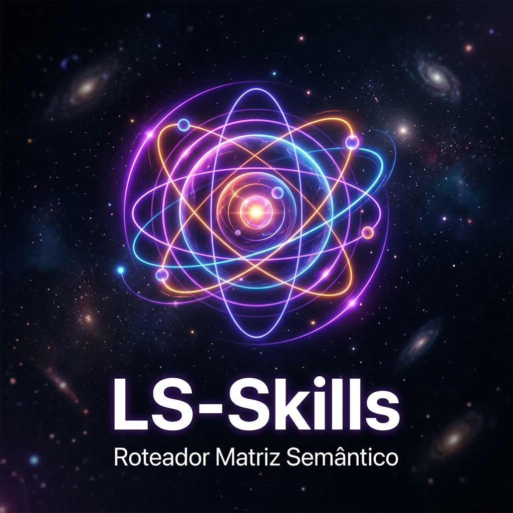

<div align="center">
  
  <h1>LS-Skills 🧠</h1>
  <p><strong>Roteador Matriz Semântico & Repositório de Habilidades da Studio CodeAI</strong></p>

  
  
  
</div>

---

## ⚡ Sobre o Repositório

O **LS-Skills** não é um mero agregador de prompts; é a **Esponja Neural** do ecossistema [Studio CodeAI](https://github.com/StudioCodeAI/Lya-Studio-Coder). 
Projetado para operar em **Modo ADM-ECO**, este repositório utiliza a arquitetura de **Roteador Matriz** para injetar inteligência sob demanda, reduzindo drasticamente o consumo de tokens.

> Em vez de carregar 2.000 skills no início da sessão, o agente lê apenas o `SKILL_MATRIX.md`. A matriz roteia o agente para a habilidade perfeita, extraindo-a do GitHub ou do banco local Core5.

## 🛠️ Modos de Operação (Core)

- **Modo ADM**: Autonomia total de execução, assumindo arquitetura e refatoração com zero hesitação.
- **Modo ECO**: Lazy-loading extremo e respostas enxutas focadas no *Roadmap Vivo*.
- **Metodologia CURE**: Algoritmo de auto-correção que permite à IA consertar os próprios builds e armazenar "Cicatrizes" (CURE SCARs) para imunidade futura.

## 📦 Catálogos Suportados (curadoria própria)

Ponteiros hand-picked, testados e usados de verdade pela Lya — cada entrada é `id/tags/source_url/description`, nunca o conteúdo pesado (ver protocolo de ingestão abaixo).

| Área | Arquivo de Roteamento | Ferramentas Indexadas |
|---|---|---|
| **Marketing** | `catalogs/seo.json` | Agentic SEO, Core Web Vitals, Schema. |
| **QA** | `catalogs/automation.json` | Playwright, Automação E2E. |
| **Engenharia** | `catalogs/development.json` | Padrões de arquitetura, Hooks, plugins de coding agent (ex: roteamento híbrido Claude+Antigravity/Gemini). |
| **Infra de IA (Gateway)** | `catalogs/omnirouter.json` | Roteamento multi-provider, A2A, MCP, combos, compressão, resiliência — 45 skills auto-geradas do OmniRouter. |

## 🌐 Fontes Mestras (o repertório completo por trás do roteador)

Isto não é "um projetinho" — o roteador acima é só a ponta curada. Por trás dele, a Studio CodeAI mantém (e mantém sincronizado no Core5) duas fontes mestras muito maiores:

| Fonte | Escala | Conteúdo |
|---|---|---|
| **[StudioCodeAI/antigravity-awesome-skills](https://github.com/StudioCodeAI/antigravity-awesome-skills)** | **1.493 skills** em 9 categorias | `architecture` (97) · `business` (85) · `data-ai` (287) · `development` (214) · `general` (359) · `infrastructure` (137) · `security` (179) · `testing` (32) · `workflow` (103) |
| **[StudioCodeAI/awesome-agent-skills](https://github.com/StudioCodeAI/awesome-agent-skills)** | **1.132+ links curados** | Skills oficiais de times reais (Anthropic, Google, Vercel, Cloudflare, Stripe, Microsoft, Figma) + comunidade — compatível Claude Code, Codex, Gemini CLI, Cursor, Copilot |

**Repertório total roteável: ~2.700+ skills**, todas acessíveis pelo mesmo princípio de lazy-loading — nunca pré-carregadas, sempre buscadas sob demanda pelo índice certo.

## 🎁 Protocolo de Ingestão — o "presente" da Studio CodeAI

Ver [`core/ls-skills-ingest-protocol.md`](core/ls-skills-ingest-protocol.md). Resumo: este repositório É o presente — só ponteiros, nunca fica pesado. Quem instala/usa ganha de graça o roteador **e** a regra de ingestão: ao clonar ou ao usar uma skill catalogada pela primeira vez, o agente baixa o conteúdo completo e salva na própria memória local (Core5, ou equivalente) **com embedding**, construindo uma base semântica buscável offline — sem depender de nós, sem re-baixar do GitHub toda hora.

## ⚙️ Automação e CLI (Ingestão de Skills)

Nós absorvemos o melhor da comunidade global automaticamente.
Utilize o script de indexação em Node.js para expandir a Esponja:

```bash
npm install
npm run ingest --url="https://github.com/exemplo/nova-skill" --category="development"
```

## 🛡️ CI/CD e Integridade

Nenhum link quebrado corrompe a nossa memória. Todos os catálogos passam por uma validação estrita via **GitHub Actions** (`catalog-validator.yml`).

---
<div align="center">
  <i>Construído sob comando do Mestre Arquiteto Luis Antonio Cardozo. Mantido pela Lya | Studio CodeAI.</i>
</div>
